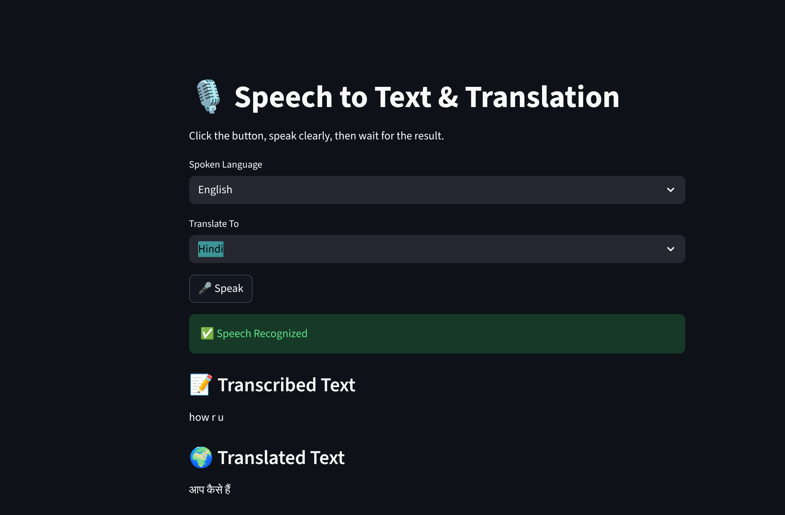

# 🎙️ Real-Time Speech-to-Text & Translation Web Application

A professional Streamlit-based web application that converts live speech into text and translates it between **English and Hindi** using automatic speech recognition and machine translation.

This project demonstrates an end-to-end **speech processing and NLP pipeline**, making it suitable for AI/ML, Data Science, and Software Engineering portfolios.

---
## 🖼️ Application Preview



## 🚀 Key Features

- 🎤 Live speech-to-text conversion using microphone input  
- 🌍 Bidirectional English ⇄ Hindi translation  
- 🖥️ Interactive and user-friendly Streamlit web interface  
- ⚡ Stable click → speak → output workflow  
- 🧠 Clean and interview-explainable architecture  

---

## 🧩 System Workflow

```
Microphone Input
        ↓
Speech Recognition (ASR)
        ↓
Text Processing
        ↓
Language Translation
        ↓
Web UI Output
```

---

## 🛠️ Tech Stack

- **Programming Language:** Python  
- **Web Framework:** Streamlit  
- **Speech Recognition:** SpeechRecognition (Google ASR)  
- **Translation Engine:** googletrans  
- **Audio Input:** PyAudio  

---

## 📂 Project Structure

```
real-time-speech-to-text-translation/
│
├── app.py
├── requirements.txt
├── README.md
└── assets/
    └── app_demo.png
```

---

## ⚙️ Installation & Setup

### 1️⃣ Clone the Repository
```bash
git clone https://github.com/Nihaal122/real-time-speech-to-text-translation.git
cd real-time-speech-to-text-translation
```

---

### 2️⃣ (Recommended) Create a Virtual Environment
```bash
python3 -m venv venv
source venv/bin/activate   # Linux / macOS
venv\Scripts\activate      # Windows
```

---

### 3️⃣ Install Dependencies
```bash
pip install -r requirements.txt
```

---

### 4️⃣ Linux Users – Microphone Dependency
```bash
sudo apt install portaudio19-dev
pip install pyaudio
```

---

## ▶️ Running the Application

```bash
streamlit run app.py
```

The application will open automatically in your default web browser.

---

## 🧪 How to Use

1. Select the **spoken language** (English or Hindi)  
2. Select the **target translation language**  
3. Click **🎤 Speak**  
4. Speak clearly for 1–3 seconds  
5. View the **transcribed text** and **translated output**  

---

## 🖼️ Application Preview


---

## 📌 Example Use Cases

- Voice-based transcription systems  
- Language translation tools  
- Accessibility applications  
- NLP and AI demonstrations  
- Educational speech-processing projects  

---

## 🧠 Engineering Highlights (Interview Talking Points)

- Designed a stable speech-processing pipeline avoiding unreliable continuous loops  
- Handled speech recognition and translation latency effectively  
- Integrated ASR and machine translation into a single workflow  
- Built a clean and modular Streamlit UI suitable for real-world demos  

---

## ⚠️ Notes

- Requires an active internet connection for speech recognition and translation  
- Microphone permissions must be enabled  
- Optimized for clarity and reliability rather than continuous streaming  

---

## 📄 License

This project is open-source and intended for educational and portfolio use.

---

## 👤 Author

**Nihaal Khanna**  
GitHub: https://github.com/Nihaal122  

---
